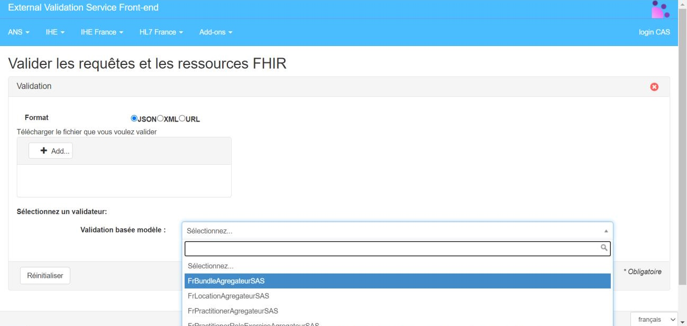
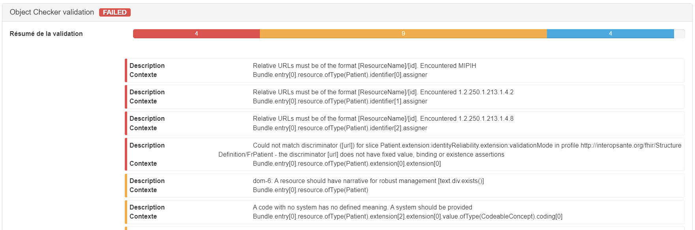

# Validateurs - Service d'Accès aux Soins v1.2.0

## Validateurs

 
There is no translation page available for the current page, so it has been rendered in the default language 

### Validateur ressources

Le validateur mis à disposition des industriels dans le cadre du projet SAS offre la possibilité de tester le format d'un fichier json, en le validant contre un profil FHIR. Il permet de vérifier que les réponses sont correctement formatées, que l'ensemble des informations obligatoires sont bien présentes et que les données codifiées exploitent les bonnes nomenclatures.

Le validateur est disponible sur l'espace de test (plateforme Gazelle) de l'ANS : [https://interop.esante.gouv.fr/evs/fhir/validator.seam?standard=37](https://interop.esante.gouv.fr/evs/fhir/validator.seam?standard=37). Il est désormais nécessaire de s'authentifier afin d'accéder aux services de l'espace de tests.

Pour effectuer la validation d'un fichier, il suffit de sélectionner le format `JSON`, d'ajouter le fichier via le bouton `Add…`, de sélectionner un validateur parmi la liste puis de cliquer sur `valider`.

* **Figure 1 - Accès au validateur**: 

Un rapport de test mettant en valeur les erreurs bloquantes et les différents warnings s'affichera :

* **Figure 2 - Rapport de validation**: 

Pour que le validateur puisse effectuer correctement les contrôles au niveau de la structure, il est nécessaire que le fichier json contienne pour chacune des ressources, le meta.profile (URL canonique) correspondant.

Par exemple :

```
{"resourceType": "Bundle",
"id": "8cbb33dc-779e-45e9-a5f6-ea66101288c5",
"meta": {
  "profile": [
    "http://sas.fr/fhir/StructureDefinition/BundleAgregateur"
  ]
}
}

```

**Note :**
 **Il y a actuellement des inconsistances dans les URLs canoniques des différents profils contenus dans ce guide, certaines URLs sont au format "http://sas.fr/fhir/…" et d'autres au format "https://interop.esante.gouv.fr/ig/fhir/sas/…". L'uniformisation n'a pas été effectuée pour cette release pour éviter les changements non rétrocompatibles. Ce changement sera à anticiper lors des prochaines releases.**

Un validateur a été mise en place pour les cas d'usage ci-dessous :

* agrégation de créneaux de disponibilités - PS à titre individuel
* agrégation de créneaux de disponibilités - CPTS
* agrégation de créneaux de disponibilités - SOS médecins
* gestion des informations de RDV

Tableau des validateurs à utiliser par cas d'usage

| | | | |
| :--- | :--- | :--- | :--- |
| Agrégateur - PS indiv. | Bundle | FrBundleAgregateur | http://sas.fr/fhir/StructureDefinition/BundleAgregateur |
| Agrégateur - PS indiv. | Slot | FrSlotAgregateur | http://sas.fr/fhir/StructureDefinition/FrSlotAgregateur |
| Agrégateur - PS indiv. | Schedule | FrScheduleAgregateur | http://sas.fr/fhir/StructureDefinition/FrScheduleAgregateur |
| Agrégateur - PS indiv. | Practitioner | FrPractitionerAgregateur | http://sas.fr/fhir/StructureDefinition/FrPractitionerAgregateur |
| Agrégateur - PS indiv. | PractitionerRole | FrPractitionerRoleExerciceAgregateur | http://sas.fr/fhir/StructureDefinition/FrPractitionerRoleExerciceAgregateur |
| Agrégateur - PS indiv. | Location | FrLocationAgregateur | http://sas.fr/fhir/StructureDefinition/FrLocationAgregateur |
| Agrégateur - CPTS | Bundle |   | https://interop.esante.gouv.fr/ig/fhir/sas/StructureDefinition/sas-cpts-bundle-aggregator |
| Agrégateur - CPTS | Slot |   | https://interop.esante.gouv.fr/ig/fhir/sas/StructureDefinition/sas-cpts-slot-aggregator |
| Agrégateur - CPTS | Schedule | FrScheduleAgregateur | http://sas.fr/fhir/StructureDefinition/FrScheduleAgregateur |
| Agrégateur - CPTS | Practitioner | FrPractitionerAgregateur | http://sas.fr/fhir/StructureDefinition/FrPractitionerAgregateur |
| Agrégateur - CPTS | PractitionerRole | FrPractitionerRoleExerciceAgregateur | http://sas.fr/fhir/StructureDefinition/FrPractitionerRoleExerciceAgregateur |
| Agrégateur - CPTS | Location | FrLocationAgregateur | http://sas.fr/fhir/StructureDefinition/FrLocationAgregateur |
| Agrégateur - CPTS | Healthcare Service |   | https://interop.esante.gouv.fr/ig/fhir/sas/StructureDefinition/sas-cpts-healthcareservice-aggregator |
| Agrégateur - CPTS | Organization |   | https://interop.esante.gouv.fr/ig/fhir/sas/StructureDefinition/sas-cpts-organization-aggregator |
| Agrégateur - SOS | Bundle |   | https://interop.esante.gouv.fr/ig/fhir/sas/StructureDefinition/sas-sos-bundle-aggregator |
| Agrégateur - SOS | Slot |   | https://interop.esante.gouv.fr/ig/fhir/sas/StructureDefinition/sas-sos-slot-aggregator |
| Agrégateur - SOS | Schedule |   | https://interop.esante.gouv.fr/ig/fhir/sas/StructureDefinition/sas-sos-schedule-aggregator |
| Agrégateur - SOS | Location |   | https://interop.esante.gouv.fr/ig/fhir/sas/StructureDefinition/sas-sos-location-aggregator |
| Agrégateur - SOS | Organization |   | https://interop.esante.gouv.fr/ig/fhir/sas/StructureDefinition/sas-sos-organization-aggregator |

