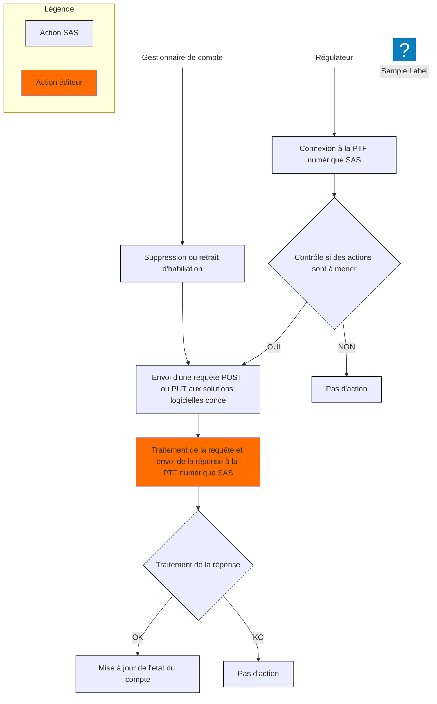

A ce jour, les API ont pour vocation de répondre aux cas d'usage suivants :
1. Service exposé par une solution de prise de rendez-vous en ligne consommé par la plateforme SAS
  - Recherche de créneaux
  - Gestion des comptes régulateurs
1. Service exposé par la plateforme SAS consommé par une solution de prise de rendez-vous en ligne
  - Création de rendez-vous
  - Mise à jour de rendez-vous

Pour les cas d'usage couverts par ces API :
- Le système consommateur doit disposer des points d'accès et des moyens d'authentification (authentification mTLS avec des certificats IGC-Santé).

### Agrégateur - Recherche de créneaux

#### Description du cas d'usage

##### PS à titre individuel - CPTS
L'objectif de cette interface est de permettre l'agrégation des créneaux de disponibilités des solutions logicielles d'agenda avec prise de RDV dans la plateforme numérique SAS :
- Flux <b>INT_R01</b> : solution d'agenda pour les **PS à titre individuel**
- Flux <b>INT_R04</b> : solution d'agenda pour les **PS appartenant à une ou plusieurs CPTS**

Le schéma de présentation générale ci-dessous illustre ce cas d'usage :

<table align="center">
    <tr>
        <td align ="center">
            

                
            

        </td>    
    </tr>
    <tr>
        <td align ="center">
            <b>Figure 1 - Présentation recherche de créneaux PS indiv. - CPTS </b>
        </td>
    </tr>
</table>

Les créneaux de disponibilités sont renseignés par les professionnels effecteurs de soins ou délégataires dans leur solution logicielle d'agenda. Le flux décrit ci-dessous permet de récupérer et d'afficher dans la plateforme numérique SAS les créneaux selon les modalités définies lors des Groupes de Travail en bilatérales avec l'ANS.
Lors d'une recherche d'offre de soins sur la plateforme numérique SAS, le moteur de recherche va s'appuyer sur les référentiels nationaux pour identifier l'offre correspondant aux critères de recherche. Une **liste de 1 à 25 RPPS/ADELI** est envoyée aux solutions logicielles éditeurs pour identifier les créneaux de disponibilités des professionnels de santé (PS) correspondants. Les types de créneaux remontés dans la plateforme sont :
- Les créneaux visibles du grand public hors ceux réservés pour la patientèle
- Les créneaux visibles des professionnels de santé hors ceux de structures
- Les créneaux dédiés au SAS, le cas échéant
- Les créneaux visibles des structures de type CPTS

##### SOS Médecins
L’objectif de cette interface est de permettre l’agrégation des créneaux de disponibilités dans la plateforme numérique SAS des professionnels de santé exerçants au sein d’une association SOS Médecins. Ces créneaux sont renseignés dans un logiciel de gestion d’agenda avec prise de rendez-vous.

Le schéma de présentation générale ci-dessous illustre ce cas d’usage :

<table align="center">
    <tr>
        <td align ="center">
            

                
            

        </td>    
    </tr>
    <tr>
        <td align ="center">
            <b>Figure 2 - Présentation recherche de créneaux SOS Médecins </b>
        </td>
    </tr>
</table>

Les créneaux de disponibilités des Points Fixes de Garde (PFG), lieux de consultation SOS Médecins, sont renseignés par les associations dans les solutions logicielles d’agendas. Le flux décrit ci-dessous permet de récupérer et d’afficher dans la plateforme numérique SAS les créneaux selon les modalités définies lors des Groupes de Travail en bilatérales avec l’ANS.
Lors d’une recherche d’offre de soins sur la plateforme numérique SAS, le moteur de recherche va s’appuyer sur les référentiels nationaux enrichis pour identifier l’offre de soins correspondant aux critères de recherche. Une **liste de 1 à 10 SIRET**, identifiant national de structure (IDNST) d’une association SOS Médecins, est envoyée aux solutions logicielles éditeurs pour identifier les créneaux de disponibilités des Points Fixes de Garde (PFG) correspondants. Les types de créneaux remontés dans la plateforme sont :
-	Les créneaux visibles du grand public
-	Les créneaux dédiés au SAS, le cas échéant

##### Format commun des échanges 
L'agrégateur de créneaux fait intervenir de nombreux acteurs, pour la plupart externes au SAS. Il est donc nécessaire de s'assurer d'une technologie commune aux différentes plateformes.
Les échanges reposent sur des **webservices se basant sur l'API REST du standard HL7 FHIR (R4)**.

Le schéma ci-dessous illustre les échanges à mettre en oeuvre entre la plateforme numérique SAS, et les différentes solutions interfacées :

    


#### Structure de la réponse

##### PS à titre individuel - CPTS
La structure de réponse attendue inclut l’ensemble des créneaux de disponibilités correspondant à la requête réalisée par la plateforme numérique SAS.
1 à n créneaux de consultation (Slot) peuvent être rattachés à 1 agenda (Schedule) qui représente 1 lieu de consultation (PractitionerRole), lui-même rattaché à 1 PS (Practitioner). Si des créneaux de consultation sont proposés pour plusieurs lieux de consultation, on aura autant d’agendas (Schedule) que de lieux de consultation (PractitionerRole).

Dans le cas où un créneau CPTS est transmis, la transmission de l’information sur le type de créneau « CPTS » est attendu ainsi que les données de la structure CPTS associée. 
Au niveau de la structure de réponse, 1 à n créneaux de consultation CPTS (Slot) peuvent être rattachés à 1 ou n prestations de soins (FrHealthcareService) qui sont chacun rattachées à 1 structure CPTS (FrOrganization). Pour le reste de la structure de réponse, celle -ci reste identique à ce qui a été présenté précédemment.

Le schéma ci-dessous présente une synthèse de la structure attendue :

    


##### SOS Médecins
La structure de réponse attendue inclut l’ensemble des créneaux de consultation disponibles correspondant à la requête réalisée par la plateforme numérique SAS.
1 à n créneaux de consultation (Slot) peuvent être rattachés à 1 agenda (Schedule) qui représente 1 point fixe de garde (Location), lui-même rattaché à 1 association SOS Médecins (Organization). Si des créneaux de consultation sont proposés pour plusieurs PFG, on aura autant d’agendas (Schedule) que de PFG (Location).

Le schéma ci-dessous présente une synthèse de la structure attendue :

    


### Gestion des comptes régulateurs
L’objectif de cette interface, flux INT_R02, est de permettre la gestion automatisée des comptes régulateurs 
SAS qui auront besoin d’accéder aux solutions logicielles de prise de RDV dans le cadre de leurs fonctions. 
Cela prend en compte la création, la modification ou la suppression des comptes identifiés.

Pour la mise en place de ce flux, il est nécessaire de s’assurer d’une technologie commune aux différentes 
plateformes. Les échanges reposent sur des webservices se basant sur l’API REST du standard HL7 
FHIR, et respectant les spécifications des flux 1a et 1b du volet d’agendas partagés du Cadre 
d’Interopérabilité des Systèmes d’Information de Santé (CI-SIS).

Lorsqu'un compte régulateur est créé dans la plateforme SAS, celle-ci transmet une requête de création de compte dans la solution logicielle éditeur.

Le schéma ci-dessous illustre l'échange à mettre en oeuvre :

    


La modification de compte peut porter sur chacun des éléments de la ressource transmise (nom, prénom, mail, ID national,habilitation).

Le schéma ci-dessous illustre l'échange à mettre en oeuvre :

    


Afin de limiter le nombre d’appels émis vers les solutions logicielles éditeurs, et éviter d’avoir à gérer des créations ou mises à jour massives de comptes (batch d’initialisation, reprise, etc.), les mécaniques suivantes ont été mises en œuvre pour le déclenchement des requêtes :
- Pour la création ou modification de compte, le déclenchement de la requête est lié à la connexion de l’utilisateur à la plateforme numérique SAS. Lors de la connexion du régulateur, un contrôle est effectué afin d’identifier si des actions sont à mener dans les solutions logicielles éditeurs. Dans le cas où des solutions sont identifiées, les requêtes correspondantes sont émises et l’état du compte est mis à jour dans la plateforme numérique SAS.
- Pour la suppression ou retrait d’habilitation uniquement, le déclenchement de la requête est émis instantanément.
Le schéma ci-dessous illustre les éléments décrits ci-dessus :

<table align="center">
    <tr>
        <td align ="center">
            

                
            

        </td>    
    </tr>
</table>

**Autres règles de gestion fonctionnelles à prendre en compte par les éditeurs :**
- A la création du compte, ne pas avoir d’étape « vérification du mail » ni de mail de confirmation de création de compte
- L’ANS et l’éditeur conviendront du fonctionnement attendu pour la génération d’un mot de passe suite à la création du compte. L’attendu est de générer un mot de passe de manière automatisée (réinitialisable via la fonctionnalité « mot de passe oublié »)
- La solution logicielle éditeur devra proposer un niveau d’habilitation dédié aux régulateurs et répondant aux besoins de la plateforme numérique SAS. L’utilisateur ne doit pouvoir en disposer que lorsqu’il se connecte via la plateforme numérique SAS (présence du paramètre origin=sas lors de la redirection). Si l’utilisateur se connecte par un autre biais, les fonctionnalités associées à cette habilitation ne doivent pas être disponibles
- Lors de la première connexion, à la suite de la création du compte, le régulateur devra souscrire et valider individuellement les conditions contractuelles de l’éditeur préalablement transmises (CGU)
- Il est attendu pour les éditeurs ayant implémenté le flux INT_R01 d’agrégation des créneaux de disponibilités, de réutiliser le endpoint et la sécurisation mTLS associée pour le flux INT_R02 de gestion des comptes régulateurs
- Certains régulateurs n’ayant pas encore d’identifiant national à date, il est attendu que l’éditeur soit en mesure de gérer les comptes soit sur la base de l’identifiant national ou de l’identifiant technique SAS selon ce qui est transmis par la plateforme numérique SAS

### Gestion des informations rendez-vous

L'objectif de cette interface, flux INT_R03, est de permettre la transmission des données liées à l'usage de la fonctionnalité de prise de RDV par les régulateurs provenant de la plateforme numérique SAS, dans les solutions logicielles d'agenda.
Le schéma de présentation générale ci-dessous illustre le cas d'usage :

<table align="center">
    <tr>
        <td align ="center">
            

                
            

        </td>    
    </tr>
    <tr>
        <td align ="center">
            <b>Figure 3 - Présentation gestion de rendez-vous</b>
        </td>
    </tr>
</table>

Après avoir sélectionné un créneau depuis la plateforme numérique SAS et avoir été redirigé vers la plateforme de prise de RDV éditeur, le régulateur prend directement RDV pour le patient dans la solution éditeur. Dès que le RDV est pris, les informations associées sont transmises à la plateforme numérique SAS via le flux INT_R03 mis en place. Lors de chaque mise à jour du RDV (annulation, modification, honoré, non honoré), l'information est transmise par le biais de ce flux à la plateforme numérique SAS. Ces données sont utilisées pour suivre l'activité réelle engendrée par le SAS, permettre l'analyse du dispositif de l'avenant 9 par la CNAM et assurer la traçabilité des RDV patients pour le suivi dans le LRM à terme.
Pour la mise en place de ce flux, il est nécessaire de s'assurer d'une technologie commune aux différentes plateformes. Les échanges reposent sur des webservices se basant sur l'API REST du standard HL7 FHIR, et respectant les spécifications des flux 6a et 6b du volet Gestion d'agendas partagés du Cadre d'Interopérabilité des Systèmes d'Information de Santé (CI-SIS).

#### Création de rendez-vous

##### Description du cas d'usage
Lorsqu'un régulateur prend RDV pour un patient au sein de la solution logicielle éditeur, celle-ci transmet une requête de création de RDV.
Le schéma ci-dessous illustre l'échange à mettre en oeuvre :

    


#### Mise à jour de rendez-vous

##### Description du cas d'usage
La mise à jour des données du RDV peut porter sur chacun des éléments de la ressource transmise (dates du créneau, PS effecteurs des soins, statut du RDV, etc.).
Le schéma ci-dessous illustre l'échange à mettre en oeuvre :

    


  