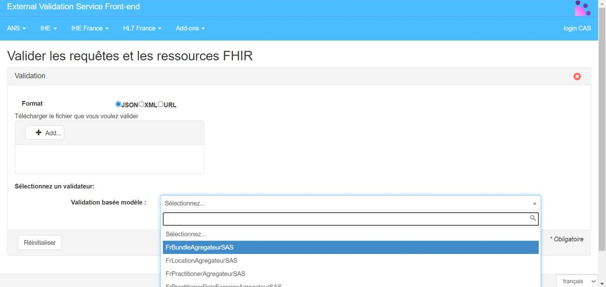

# PS indiv. - Recherche des créneaux - Service d'Accès aux Soins v1.2.0

* [**Table of Contents**](toc.md)
* **PS indiv. - Recherche des créneaux**

## PS indiv. - Recherche des créneaux

### Caractéristiques de l'API

Cette requête s'appuie sur le flux 3A du volet d'agenda partagé du [CI-SIS volet Gestion Agenda Partagés](https://esante.gouv.fr/sites/default/files/media_entity/documents/CISIS-TEC_SPECIFICATIONS_TECHNIQUES-GESTION_AGENDAS_PARTAGES_V1.0.pdf).

| | |
| :--- | :--- |
| **Endpoint** |   |
| **Header** | Accept: application/json+fhir |
| **Encodage** | UTF-8 |
| **Version FHIR** | 4.0.1 |
| **Version package** |   |
| **Publication** |   |

### Construction de la requête de base

| | |
| :--- | :--- |
| **Interaction FHIR** | Search[[1]](#_ftn1) |
| **Méthode http associée** | GET |
| **Ressource recherchée** | Slot |
| **Construction requête de base** | `GET[base]/Slot{?[parameters]{&_format=[mime-type]}}` |

[[1]](#_ftnref1) [https://www.hl7.org/fhir/http.html#search](https://www.hl7.org/fhir/http.html#search) et [https://www.hl7.org/fhir/http.html#general](https://www.hl7.org/fhir/http.html#general)

### Construction de la réponse de base

Cette réponse s'appuie sur le flux 4A du volet d'agenda partagé du CI-SIS.

#### Réponse de base – Succès

Lien vers la spécification FHIR : [https://www.hl7.org/fhir/bundle.html](https://www.hl7.org/fhir/bundle.html)

Si la recherche est un succès, le serveur répond :

* Un header avec un code 200 OK HTTP
* Un body contenant une ressource [Bundle](https://www.hl7.org/fhir/bundle.html) dont le type = searchset. Le bundle encapsule 0 à n ressources Slot corespondant aux critères de recherche plus les ressources incluses correspondant aux critères de recherche. Le service indique le total trouvé dans une balise `total`. Dans le cas où il n'y a pas de résultat le service renvoie `total`: 0.

Remarque : la recherche est un succès à partir du moment où la requête peut être exécutée. Il peut il y avoir 0 à n correspondances.

Plus de précision sur la spécification FHIR : [https://www.hl7.org/fhir/http.html](https://www.hl7.org/fhir/http.html)

#### Réponse de base – Echec

Lien vers la spécification FHIR : [https://www.hl7.org/fhir/operationoutcome.html](https://www.hl7.org/fhir/operationoutcome.html)

Si la recherche échoue, le serveur doit répondre :

* Un header avec un un code erreur HTTP 4XX ou 5XX
* Un body contenant une ressource OperationOutcome[^3] qui donne les détails sur la raison de l'échec

Remarque : l'échec d'une recherche est la non-possibilité d'exécuter la requête, ce qui est différent d'aucune correspondance à la recherche. Plus de précision sur la spécification FHIR : [https://www.hl7.org/fhir/http.html](https://www.hl7.org/fhir/http.html)

### Critères de recherche

| | | | | | |
| :--- | :--- | :--- | :--- | :--- | :--- |
| **ID** | **Description** | **Paramètre** | **Type** | **Obligatoire** | **Cardinalité** |
| 1 | Date de début de la recherche de créneaux | startavec le préfixe ge | date | Oui | 1..1 |
| 2 | Date de fin de la recherche de créneaux | startavec le préfixe le | date | Oui | 1..1 |
| 3 | Liste des identifiants nationaux des PS (le préfixe correspondant à l'identifiant sera transmis) | schedule.actor:Practitioner.identifier | token | Oui | 1..25 |
| 4 | Statut des créneaux | status | tokenvaleur: free | Oui | 1..1 |

Par ailleurs, en complément des ressources Slot, afin de récupérer l'ensemble des informations qui leur sont rattachées et qui seront potentiellement exploitées par le SAS, deux paramètres supplémentaires sont exploités :

* `_include=Slot:schedule` indique qu'il est nécessaire de transmettre les ressources Schedule associées aux Slot. La présence de cette ressource est nécessaire pour permettre de faire le lien entre le créneau (Slot) et les ressources Practitioner et PractitionerRole associées.
* `_include:iterate=Schedule:actor` indique qu'il est nécessaire de transmettre les ressources actor référencées dans les ressources Schedule transmises. En particulier, les ressources Practitioner et PractitionerRole (incluant la ressource Location dans une élément "contained") sont attendues.

### Exemple de requête

La requête ci-dessous correspond à une recherche de créneaux disponibles entre le 02 janvier 2021 à 10h et le 06 janvier 2021 à 10h pour les PS correspondant aux RPPS préfixés : 810101288385, 800001288385 ou 810106738385.

**Requête :**

`get[BASE]/Slot?_include=Slot:schedule&_include:iterate=Schedule:actor&start=ge2021-01-02T10:00:00&start=le2021-01-06T10:00:00&schedule.actor:Practitioner.identifier=urn:oid:1.2.250.1.71.4.2.1|810101288385, urn:oid:1.2.250.1.71.4.2.1|800001288385,urn:oid:1.2.250.1.71.4.2.1|810106738385&status=free`

**Réponse simplifiée :**

**Corps de la réponse complète :**

La réponse ci-dessous correspond à :

1. 2 créneaux disponibles pour Docteur Sébastien THOMAS (RPPS : 810100050075)
* 1 créneau au 1 rue Mme Delmas (47000). L'ID de la structure associée est 1810004421. Le 5 novembre 2021 de 9h à 9h30 ayant les caractéristiques suivantes :

* Avec prise de RDV,
* Visible du grand public,
* Au cabinet ou en téléconsultation
* Pour le motif `Visite de contrôle`
* Les spécialités codifiées associées sont SM54, SM05. - 1 créneau au 30 rue Mme Delmas (47000). L'ID de la structure associée est 1810004956. Le 5 novembre 2021 de 11h à 11h30 ayant les caractéristiques suivantes :
* Sans prise de RDV,
* Visible des professionnels,
* Au cabinet,
* Pour le motif `Visite urgente`
* La spécialité codifiée associée est SM54

1. 2 créneaux disponibles pour Médecin Guillaume MARCEL (RPPS : 810002673899) au 1 rue Mme Delmas (47000). L'ID de la structure associée est 1810004421
* 1 créneau le 4 novembre 2021 de 14h20 à 14h40 ayant les caractéristiques suivantes :

* Avec prise de RDV,
* Visible des professionnels et du grand public,
* En téléconsultation
* Pour le motif `Visite de contrôle`
* La spécialité codifiée associée est SM41 - 1 créneau le 4 novembre 2021 de 14h40 à 15h00 ayant les caractéristiques suivantes :
* Avec prise de RDV,
* Visible des professionnels et du grand public,
* A domicile
* Pour le motif `Visite de contrôle` et `Consultation de suivi pneumologique`
* Les spécialités codifiées associées sont SM41 et SM54

Pour consulter l'exemple en plein écran, cliquer [ici](./Bundle-ExampleBundlePSIndiv.json.md).

<iframe scrolling="yes" src="./Bundle-ExampleBundlePSIndiv.json" width="100%" style="border: 1px solid #cccccc; border-radius: 4px; background: #f5f2f0;" height="300"></iframe>


### Nomenclatures

Cette section détaille les nomenclatures à utiliser afin de renseigner les différents éléments codifiés de la réponse.

* **Statut du créneau :** 
* L'utilisation de la nomenclature standard slotstatus ([http://hl7.org/fhir/R4/valueset-slotstatus.html](http://hl7.org/fhir/R4/valueset-slotstatus.html)) est attendue. Cependant, la plateforme numérique SAS ne récupérant que des créneaux disponibles, ce champ aura systématiquement la valeur `free`.
 
* **Spécialités ou compétences particulières du PS associées au créneau :** 
* Dans le cadre du profil FrSlot, l'élément specialty est lié à la nomenclature des spécialités ordinales du MOS ([https://mos.esante.gouv.fr/NOS/TRE_R38-SpecialiteOrdinale/FHIR/TRE-R38-SpecialiteOrdinale/](https://mos.esante.gouv.fr/NOS/TRE_R38-SpecialiteOrdinale/FHIR/TRE-R38-SpecialiteOrdinale/)). La plateforme numérique SAS sera cependant en mesure de traiter d'autres compétences ou spécialités transmises sous la forme d'une donnée structurée au sein de l'élément `coding`, ou sous la forme d’un texte libre au niveau de l'élément `text`.
 
* **Type de créneau :** 
* Afin de répondre aux besoins de la plateforme numérique SAS, une nomenclature dédiée a été mise en oeuvre ([https://mos.esante.gouv.fr/NOS/TRE_R314-TypeCreneau/FHIR/TRE-R314-TypeCreneau](https://mos.esante.gouv.fr/NOS/TRE_R314-TypeCreneau/FHIR/TRE-R314-TypeCreneau)). 3 types de créneaux sont présentés ci-dessous. A noter qu'un créneau peut porter une combinaison de ces valeurs : 
* PUBLIC – Créneau de soins défini par un professionnel de santé ou son délégataire dans son logiciel de prise de RDV accessible par le grand public
* PRO – Créneau de soins défini par un professionnel de santé ou son délégataire dans son logiciel de prise de RDV accessible à l'ensemble des PS
* SNP – Créneau de soins défini par un professionnel de santé ou son délégataire dans son logiciel de prise de RDV accessible par les Régulateurs et OSNP
 
 
* **Type de consultation :** 
* L'utilisation de la nomenclature standard ActEncounterCode ([https://www.hl7.org/fhir/v3/ActEncounterCode/vs.html](https://www.hl7.org/fhir/v3/ActEncounterCode/vs.html)) est attendue. Cette nomenclature contient différentes notions, cependant, la plateforme numérique SAS gère les 3 types de créneaux ci-dessous. A noter qu'un créneau peut porter une combinaison de ces valeurs : 
* AMB – Consultation au cabinet
* HH – Consultation à domicile
* VR – Téléconsultation
 
 
* **URL de redirection pour la prise de RDV :** 
* Il est attendu l'URL de redirection vers l'agenda du PS concerné. Si l'utilisateur vient du SAS et n'est pas authentifié, il est demandé de le rediriger vers la page d'authentification de la solution éditeur avant d'accéder à l'agenda du PS. Afin de faciliter l'implémentation de la règle métier, la PTF numérique SAS ajoute un paramètre `origin` à l'URL transmise par l'éditeur au moment de la redirection pour identifier la provenance.
 
* **Créneau avec ou sans RDV :** 
* L'utilisation de la nomenclature standard AppointmentReasonCodes ([https://www.hl7.org/fhir/v2/0276/index.html](https://www.hl7.org/fhir/v2/0276/index.html)) est attendue. Cette nomenclature contient différentes notions, cependant, la plateforme numérique SAS gère les 2 valeurs ci-dessous : 
* ROUTINE – Créneau avec prise de RDV possible.
* WALKIN – Créneau sans prise de RDV possible
 
 

### Validateur ressources

Le validateur mis à disposition des développeurs dans le cadre du projet SAS offre la possibilité de tester le format des bundles de réponse générés. Il permet de vérifier que les réponses sont correctement formatées, que l'ensemble des informations obligatoires sont bien présentes et que les données codifiées exploitent les bonnes nomenclatures. Pour que le validateur puisse effectuer correctement les contrôles au niveau de la structure, il est nécessaire de renseigner pour chacun des "resourceType" correspondant, le meta.profile "URL" ci-dessous :

* http://sas.fr/fhir/StructureDefinition/BundleAgregateur
* http://sas.fr/fhir/StructureDefinition/FrLocationAgregateur
* http://sas.fr/fhir/StructureDefinition/FrPractitionerAgregateur
* http://sas.fr/fhir/StructureDefinition/FrPractitionerRoleExerciceAgregateur
* http://sas.fr/fhir/StructureDefinition/FrScheduleAgregateur
* http://sas.fr/fhir/StructureDefinition/FrSlotAgregateur

Ci-dessous un exemple :

```
"resourceType": "Bundle",
"id": "8cbb33dc-779e-45e9-a5f6-ea66101288c5",
"meta": {
  "profile": [
    "http://sas.fr/fhir/StructureDefinition/BundleAgregateur"
  ]
},

```

Le validateur est disponible sur l'espace de test de l'ANS : [https://interop.esante.gouv.fr/evs/fhir/validator.seam?standard=37](https://interop.esante.gouv.fr/evs/fhir/validator.seam?standard=37). Il est désormais nécessaire de s'authentifier afin d'accéder aux services de l'espace de tests. Afin de tester un fichier, il suffit de sélectionner le format `JSON`, d'ajouter le fichier via le bouton `Add…`, de sélectionner le modèle `FrBundleAgregateurSAS` puis de cliquer sur `valider` :

* **Figure 1 - Accès au validateur agrégateur de créneaux**: 

Vous obtiendrez alors un rapport de test mettant en valeur les erreurs bloquantes et les différents warnings :

* **Figure 2 - Rapport validateur agrégateur de créneaux**: 

